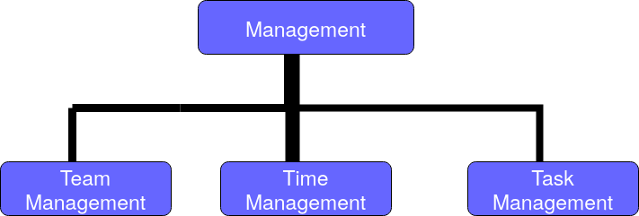
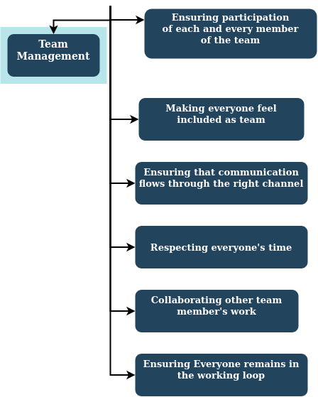
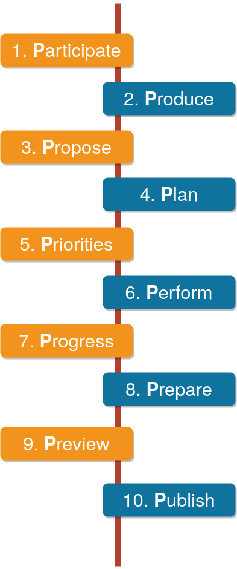
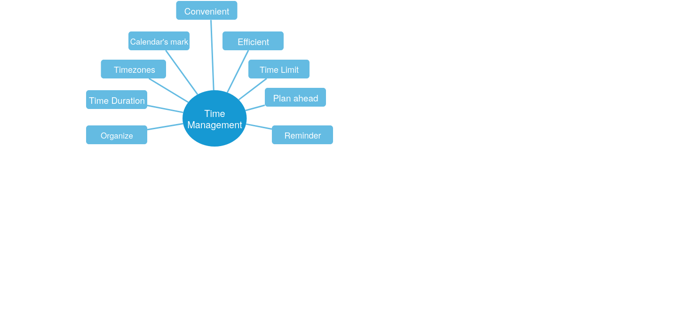

# Management

Remote success falls on the manager, which is why you want to give enough detail on tasks so your remote workers can succeed. But you also don’t want to spend an excessive amount of time assigning projects (when you could be doing other things)
The reality is project management is your new job when you choose to work with remote folk
So, to reach that balance, you need to A) give concise directions, and B) anticipate the things the remote worker may need, to reduce their need to ask questions you could have already answered for them. 17% of remote workers have problems collaborating and communicating with their team when their managers can't do these basic things.

## Team Management

Remote success falls on the manager, which is why you want to give enough detail on tasks so your remote workers can succeed. But you also don’t want to spend an excessive amount of time assigning projects (when you could be doing other things)
Remote success falls on the manager, which is why you want to give enough detail on tasks so your remote workers can succeed. But you also don’t want to spend an excessive amount of time assigning projects (when you could be doing other things)
The reality is project management is your new job when you choose to work with remote folk
So, to reach that balance, you need to A) give concise directions, and B) anticipate the things the remote worker may need, to reduce their need to ask questions you could have already answered for them. 17% of remote workers have problems collaborating and communicating with their team when their managers can't do these basic things.Remote success falls on the manager, which is why you want to give enough detail on tasks so your remote workers can succeed. But you also don’t want to spend an excessive amount of time assigning projects (when you could be doing other things)
The reality is project management is your new job when you choose to work with remote folk
 
 
 
 
 
 
 ## Task Managemt

1. **Partcipate:** you have to. 
2. **Produce:** 

Remote success falls on the manager, which is why you want to give enough detail on tasks so your remote workers can succeed. But you also don’t want to spend an excessive amount of time assigning projects (when you could be doing other things)
The reality is project management is your new job when you choose to work with remote folk
So, to reach that balance, you need to A) give concise directions, and B) anticipate the things the remote worker may need, to reduce their need to ask questions you could have already answered for them. 17% of remote workers have problems collaborating and communicating with their team when their managers can't do these basic things.Remote success falls on the manager, which is why you want to give enough detail on tasks so your remote workers can succeed. But you also don’t want to spend an excessive amount of time assigning projects (when you could be doing other things)
The reality is project management is your new job when you choose to work with remote folk
So, to reach that balance, you need to A) give concise directions, and B) anticipate the things the remote worker may need, to reduce their need to ask questions you could have already answered for them. 17% of remote workers have problems collaborating and communicating with their team when their managers can't do these basic things.

## Time Management

