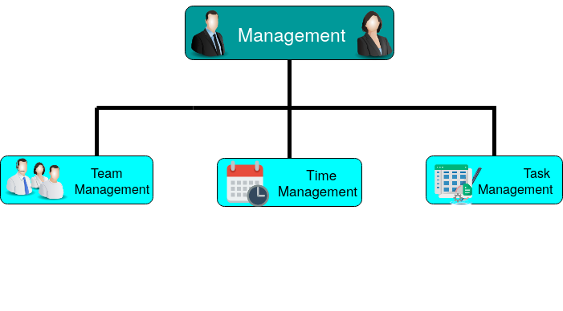

# Leadership and Management
## Management

 The term <b><i>"Management"</i></b> always leads us to think about the ways for <i>organising, controlling</i> and most pre-eminently <i>coordinating</i> the works, events and persons together as a team so as to accomplish <b>"Team Work"</b>. <i>But have you ever give a thought that it never discusses about the location of the team members, no matter wherever you and your team members are located, whether nearby or faraway, you have to manage your tasks and work efficiently as well as productively!!!</i>:thinking: 

While working in a group or a team, every individual must take care of the following classifications of the *Management*:   

 
While keenly observing the above classifications, it should be noted that it follows <b>3T's Practices</b>:
1. <strong>T</strong>eam Management
2. <strong>T</strong>ime Management
3. <strong>T</strong>ask Management

 
### Task Management
The *Task Management* will go efficiently if we all , whole as a team, must follow the following **10 P's**: 

1. <b>Participation:</b> The First <b>P</b> stands for <i>Participation</i> which emphasizes on full involvement of each and every member of a team. It's your own responsibility that you should take part in every specific discussion as one of the team member, sharing your own ideas. Of course! the manager will make ensure that everybody is present, but you should join the team by your own thought that you are also one of the <b><i>"Worthiest Member"</b></i> :busts_in_silhouette: of the team and hence you are included.

2.<b> Produce:</b> For any task to work on, the first thing is that you should have an idea to be discussed upon in a team i.e., you must <b><i> Produce</i></b> unique and varied ideas so that everybody should consider it interesting. <i>However, never hesitate to talk about the ideas with your team, no matter whether it's a small idea, your ideas are always welcome:handshake: as this is "your own team" in which you are working in.</i>

Remote success falls on the manager, which is why you want to give enough detail on tasks so your remote workers can succeed. But you also don’t want to spend an excessive amount of time assigning projects (when you could be doing other things)
Remote success falls on the manager, which is why you want to give enough detail on tasks so your remote workers can succeed. But you also don’t want to spend an excessive amount of time assigning projects (when you could be doing other things)
The reality is project management is your new job when you choose to work with remote folk
So, to reach that tobalance, you need to A) give concise directions, and B) anticipate the things the remote worker may need,
Remote success falls on the manager, which is why you want to give enough detail on task
 s so your remote workers can succeed. But you also don’t want to spend an excessive amount of time assigning projects (when you could be doing other things)
Remote success falls on the manager, which is why you want to give enough detail on tasks so your remote workers can succeed. But you also don’t want to spend an excessive amount of time assigning projects (when you could be doing other things)
The reality is project management is your new job when you choose to work with remote folk
So, to reach that tobalance, you need to A) give concise directions, and B) anticipate the things the remo
But you also don’t want to spend an excessive amount of time assigning projects (when you could be doing other things)
The reality is project management is your new job when you choose to work with remote folk
So, to reach that tobalance, you need to A) give concise directions, and B) anticipate the things the remoSo, to reach that tobalance, you need to A) give concise directions, and B) anticipate
 

 
 
 
 
 
 ## Time Management

The reality is project management is your new job when you choose to work with remote folk
So, to reach that balance, you need to A) give concise directions, and B) anticipate the things the remote worker may need, to reduce their need to ask questions you could have already answered for them. 17% of remote workers have problems collaborating and communicating with their team when their managers can't do these basic things.Remote success falls on the manager, which is why you want to give enough detail on tasks so your remote workers can succeed. But you also don’t want to spend an excessive amount of time assigning projects (when you could be doing other things)
The reality is project management is your new job when you choose to work with remote folk
So, to reach that balance, you need to A) give concise directions, and B) anticipate the things the remote worker may need, to reduce their need to ask questions you could have already answered for them. 17% of remote workers have problems collaborating and communicating with their team when their managers can't do these basic things
 

 
 
 
 
 ## Team Managemt

Remote success falls on the manager, which is why you want to give enough detail on tasks so your remote workers can succeed. But you also don’t want to spend an excessive amount of time assigning projects (when you could be doing other things)
The reality is project management is your new job when you choose to work with remote folk
So, to reach that balance, you need to A) give concise directions, and B) anticipate the things the remote worker may need, to reduce their need to ask questions you could have already answered for them. 17% of remote workers have problems collaborating and communicating with their team when their managers can't do these basic things.Remote success falls on the manager, which is why you want to give enough detail on tasks so your remote workers can succeed. But you also don’t want to spend an excessive amount of time assigning projects (when you could be doing other things)
The reality is project management is your new job when you choose to work with remote folk
So, to reach that balance, you need to A) give concise directions, and B) anticipate the things the remote worker may need, to reduce their need to ask questions you could have already answered for them. 17% of remote workers have problems collaborating and communicating with their team when their managers can't do these basic things.

